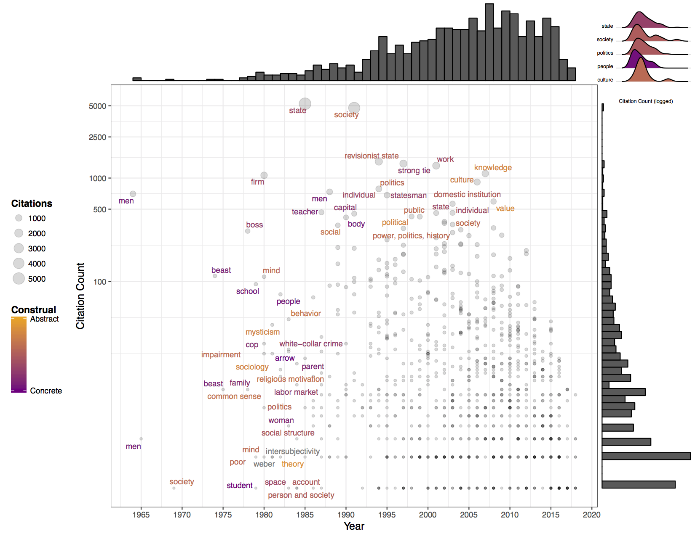

"Visualizing Bring-Backs"
================
Omar Lizardo, Dustin S. Stoltz, Marshall A. Taylor (compiler), Michael Lee Wood

First, be sure to set your working directory.

``` r
setwd("working_directory_here")
```

Below are the packages you will need to reproduce the visualization.

``` r
library(pacman)
pacman::p_load(pluralize, ggplot2, ggrepel, ggExtra, Hmisc, plyr, RColorBrewer, 
               colorRamps, tidyverse, grid, ggridges)
```

Data Acquisition and Cleaning
=============================

rvest and Google Scholar
------------------------

Using the `rvest` ([Wickham 2018](https://github.com/hadley/rvest)) package, we collected the titles, years, citation counts, author(s), and journals/books for the following search operator **intitle: “bringing” intitle: “back in”**.

If you're interested in the scraping file, send us a message!

Deduplication
-------------

We removed duplicates in three waves. First we searched for true duplicates by matching citation counts, author(s), and years. Next we matched author(s), year, and the portion of the title we refer to as “stuff,” and hand-checked those flagged to identify whether or not they were true duplicates, republished works, or different works with very similar titles. Finally, we matched year and author(s) and again hand-checked those flagged. In the case of republished works, we added the accrued citations together, and delete the later edition.

Singularization
---------------

The vast majority of terms in the construal dictionary (described below) are singular. As such, for computing construal scores and term frequencies for the inset ridge plots, we first singularized the entries in the Google Scholar data using the `pluralize` function in R ([Rudis 2016](https://github.com/hrbrmstr/pluralize)). Mass nouns that typically refer to entities in academic discourse—e.g., politics, economics, and men—were reverted back to their plural form. The only term this did not apply to was "women," which, surprisingly, is not in the construal dictionary (described below); as such, we reverted "women" to "woman." Further, since the `singularize()` function only singularizes the last term in the cell, you will need to keep an eye out for terms earlier in the phrase that you may need to singularize by hand (e.g., "workers rights" into "worker right").

Note that the CSV file included in this repository, "bringitback.csv," is the dataset **post** deduplication and singularization, which we will load now.

``` r
data.rep <- read.csv(file="bringitback.csv", header=T)
```

If you want to completely recreate the cleaned data from scratch, note that the deduplication process itself was mostly manual. The singularization function itself is simple. Note that "Singular\_Stuff"" itself is appended to the data frame, thus naming this one "Singular\_Stuff2.""

``` r
data.rep$Singular_Stuff2 <- singularize(data.rep$Stuff)
```

But you will then want to change those few mass nouns back into their plural form and manually singularize those terms earlier in the cell phrase.

Computing Construal Scores
==========================

The construal scores were computed using a large “construal-level” English dictionary ([Brysbaert, Warriner, and Kuperman 2014](http://crr.ugent.be/papers/Brysbaert_Warriner_Kuperman_BRM_Concreteness_ratings.pdf)). The dictionary is composed of 37,058 unigrams (single words) and 2,896 bigrams (two-word phrases). The nearly 40,000 entries were divided into over 210 sets of 300 terms (with terms duplicated across sets), which were then distributed to Amazon MTurk participants with instructions that they rate the extent to which the term is more “abstract” (with 1 being most abstract) or “concrete” (with 5 most concrete). Most terms were rated by at least 25 participants. Over 4,000 participants contributed to rating the terms. Only terms that were known by at least 85% of participants were included in the dictionary. Each term’s construal score in the Google Scholar data was the mean participant rating for that term in the dictionary.

Most bigrams in the Google Scholar data are not common folk phrases and therefore not included in the dictionary. Further, many of the items “brought back in” are larger than bigrams. As such, for entries greater than a unigram, we calculated the construal score as the mean rating for each word in the phrase. For example, to compute the construal score, *c<sub>t</sub>*, for “science and medicine” (an actual entry in the data), we calculated the trigram construal score as *c<sub>t</sub>* = (*c<sub>s</sub>* + *c<sub>a</sub>* + *c<sub>m</sub>*)/3—which in this case came out to 3.03, a neutral score. The largest (though infrequent) entry was a quintgram; so, at most, the construal score was an average across five terms.

The dictionary file is "conabst.csv."

Below is the code for applying the dictionary to the "Singular\_Stuff" column in data.rep. The trickiest part of this is splitting the items in "Singular\_Stuff" into individual column vectors.

Let's do that step by step. First, read in the data and select out the term list and each entry's construal score. Since the largest thing "brough back in" is a quintgram, create five versions of the dictionary, each with column names suffixed with the n-gram number (why we do this will make more sense in a bit).

``` r
conabst <- read.csv(file="conabst.csv", header=T)
vars <- c("word","concm")
for (i in 1:5) {
  assign(paste0("construals",i,sep=""), conabst[vars])
}
list <- list(construals1,construals2,construals3,construals4,construals5)
for (i in 1:5) {
  colnames(list[[i]])[1] <- paste0("extra",i,sep="")
  colnames(list[[i]])[2] <- paste0("concm",i,sep="")
}
rm(construals1,construals2,construals3,construals4,construals5)
for (i in 1:5) {
  assign(paste0("construals",i,sep=""), list[[i]])
}
```

Next, separate out the "Singular\_Stuff" column in the rep.dem data frame so that each cell will be a unigram. Then match the unigram-specific construal scores in the five separate construal dictionaries ("concm1"- "concm5") with the equivalent columns ("extra1" - "extra5") in the data.rep data frame. Don't worry about the error message. Not all entries in the Singular\_Stuff have the same number of terms, so you are going to get lots of NAs.

``` r
data.rep <- separate(data=data.rep, col=Singular_Stuff, 
                  into=c("extra1","extra2","extra3","extra4","extra5"), remove=F)
```

    ## Warning: Expected 5 pieces. Missing pieces filled with `NA` in 1300
    ## rows [1, 2, 3, 4, 5, 6, 7, 8, 9, 10, 11, 12, 13, 14, 15, 16, 17, 18, 19,
    ## 20, ...].

``` r
for (k in 1:5) {
  data.rep <- join_all(list(data.rep, list[[k]]), by=colnames(list[[k]])[1], type="left")
}
```

The next task is to find the average construal score across each row vector, depending on the number of terms in the original data.

This bit of code is ugly, and can probably be done much more efficiently with loops or the equivalent. That said, here's how we did it. First, set all of the NAs across the five construal vectors equal to zero so that the means are computed correctly. Then add up each row vector; this is the numerator for your mean. Finally (and this is the ugly part), you want to account for each possible permutation of cells for each number of terms. For example, with trigrams, the first term will probably be in the first column vector, but, if there is a dash (such as "non-state actor"), you will want to take the average of that row's entries in construal vectors 1, 3, and 4.

``` r
for (i in 26:31) {
  data.rep[,i][which(is.na(data.rep[,i]))] <- 0
}
data.rep$construal <- (data.rep$concm1+data.rep$concm2+data.rep$concm3+data.rep$concm4+data.rep$concm5)
data.rep$construal <- ifelse(data.rep$concm1!=0 & data.rep$concm2!=0 & data.rep$concm3==0 & data.rep$concm4==0 & data.rep$concm5==0, data.rep$construal/2, data.rep$construal)
data.rep$construal <- ifelse(data.rep$concm1!=0 & data.rep$concm2==0 & data.rep$concm3!=0 & data.rep$concm4==0 & data.rep$concm5==0, data.rep$construal/2, data.rep$construal)
data.rep$construal <- ifelse(data.rep$concm1!=0 & data.rep$concm2==0 & data.rep$concm3==0 & data.rep$concm4!=0 & data.rep$concm5==0, data.rep$construal/2, data.rep$construal)
data.rep$construal <- ifelse(data.rep$concm1!=0 & data.rep$concm2==0 & data.rep$concm3==0 & data.rep$concm4==0 & data.rep$concm5!=0, data.rep$construal/2, data.rep$construal)
data.rep$construal <- ifelse(data.rep$concm1==0 & data.rep$concm2!=0 & data.rep$concm3!=0 & data.rep$concm4==0 & data.rep$concm5==0, data.rep$construal/2, data.rep$construal)
data.rep$construal <- ifelse(data.rep$concm1==0 & data.rep$concm2!=0 & data.rep$concm3==0 & data.rep$concm4!=0 & data.rep$concm5==0, data.rep$construal/2, data.rep$construal)
data.rep$construal <- ifelse(data.rep$concm1==0 & data.rep$concm2!=0 & data.rep$concm3==0 & data.rep$concm4==0 & data.rep$concm5!=0, data.rep$construal/2, data.rep$construal)
data.rep$construal <- ifelse(data.rep$concm1==0 & data.rep$concm2==0 & data.rep$concm3!=0 & data.rep$concm4!=0 & data.rep$concm5==0, data.rep$construal/2, data.rep$construal)
data.rep$construal <- ifelse(data.rep$concm1==0 & data.rep$concm2==0 & data.rep$concm3==0 & data.rep$concm4!=0 & data.rep$concm5!=0, data.rep$construal/2, data.rep$construal)
data.rep$construal <- ifelse(data.rep$concm1!=0 & data.rep$concm2!=0 & data.rep$concm3!=0 & data.rep$concm4==0 & data.rep$concm5==0, data.rep$construal/3, data.rep$construal)
data.rep$construal <- ifelse(data.rep$concm1!=0 & data.rep$concm2!=0 & data.rep$concm3==0 & data.rep$concm4!=0 & data.rep$concm5==0, data.rep$construal/3, data.rep$construal)
data.rep$construal <- ifelse(data.rep$concm1!=0 & data.rep$concm2!=0 & data.rep$concm3==0 & data.rep$concm4==0 & data.rep$concm5!=0, data.rep$construal/3, data.rep$construal)
data.rep$construal <- ifelse(data.rep$concm1==0 & data.rep$concm2!=0 & data.rep$concm3!=0 & data.rep$concm4!=0 & data.rep$concm5==0, data.rep$construal/3, data.rep$construal)
data.rep$construal <- ifelse(data.rep$concm1==0 & data.rep$concm2!=0 & data.rep$concm3!=0 & data.rep$concm4==0 & data.rep$concm5!=0, data.rep$construal/3, data.rep$construal)
data.rep$construal <- ifelse(data.rep$concm1==0 & data.rep$concm2==0 & data.rep$concm3!=0 & data.rep$concm4!=0 & data.rep$concm5!=0, data.rep$construal/3, data.rep$construal)
data.rep$construal <- ifelse(data.rep$concm1!=0 & data.rep$concm2==0 & data.rep$concm3!=0 & data.rep$concm4!=0 & data.rep$concm5==0, data.rep$construal/3, data.rep$construal)
data.rep$construal <- ifelse(data.rep$concm1!=0 & data.rep$concm2!=0 & data.rep$concm3!=0 & data.rep$concm4!=0 & data.rep$concm5==0, data.rep$construal/4, data.rep$construal)
data.rep$construal <- ifelse(data.rep$concm1!=0 & data.rep$concm2!=0 & data.rep$concm3!=0 & data.rep$concm4==0 & data.rep$concm5!=0, data.rep$construal/4, data.rep$construal)
data.rep$construal <- ifelse(data.rep$concm1!=0 & data.rep$concm2!=0 & data.rep$concm3==0 & data.rep$concm4!=0 & data.rep$concm5!=0, data.rep$construal/4, data.rep$construal)
data.rep$construal <- ifelse(data.rep$concm1!=0 & data.rep$concm2==0 & data.rep$concm3!=0 & data.rep$concm4!=0 & data.rep$concm5!=0, data.rep$construal/4, data.rep$construal)
data.rep$construal <- ifelse(data.rep$concm1==0 & data.rep$concm2!=0 & data.rep$concm3!=0 & data.rep$concm4!=0 & data.rep$concm5!=0, data.rep$construal/4, data.rep$construal)
data.rep$construal <- ifelse(data.rep$concm1!=0 & data.rep$concm2!=0 & data.rep$concm3!=0 & data.rep$concm4!=0 & data.rep$concm5!=0, data.rep$construal/5, data.rep$construal)
```

And finally, we have our construal scores!

Creating the Visualization
==========================

Now we are ready to make the visualization. We'll first cover the main scatterplot, followed by the right-hand corner ridge plots.

Scatterplot
-----------

Subset the data so that it only includes papers published on or after 1964 (when Homans' "Bringing Men Back In" was published in *ASR*), and papers with at least one citation.

``` r
plot.data <- data.rep[which(data.rep$Year>=1964 & data.rep$Citations > 0),]
```

We want to plot the labels for those papers with at least one citation that are at the 95% percentile or higher. So we'll want to figure out the number of citations to which this corresponds. We'll limit the papers that go into determining these percentile cutoffs to those published during or after 1964 but before 2005.

``` r
quantile(data.rep[which(data.rep$Year>=1964 & data.rep$Year<2005 
                        & data.rep$Citations>0),"Citations"], 
         c(.95, .975, .99), na.rm = TRUE) 
```

    ##     95%   97.5%     99% 
    ##  343.25  502.75 1254.50

Now we can start putting everything together. Let's take it a few steps at a time.

``` r
p <- ggplot(plot.data, aes(Year, Citations, label=Singular_Stuff)) 
p <- p + geom_point(aes(size=Citations), alpha=.15) 
p <- p + geom_text_repel(data=data.rep[which(data.rep$Year>=1964 & 
                                               data.rep$Citations > 0),],
                         aes(color=construal, label=ifelse(Citations >= 343 | Year < 1985, 
                                          as.character(Singular_Stuff),'')), size = 3,
                         segment.alpha=0) 
```

This is the core of the plot. `geom_point(aes(size=Citations), alpha=.15)` specifies that we want a scatterplot with publication year as the *x*-axis and number of citations as the *y*-axis. We want the size of the markers proportional to the papers' citation counts, and that we want the markers to be fairly transculscent so that we can see when multiple papers occupy the same space in the plot (i.e., are published in the same year and with the same number of citations). The `geom_text_repel` function--from the `ggrepel` package (Slowikowski 2018)--is used to plot the stuff "brough back in" for a paper without marker labels overlapping. We specifically plot and color the "stuff" for papers with citations at or above the 95 percentile, as well as those published before 1985 (the year Evans, Rueschemeyer, and Skocpol published *Bringing the State Back In*). Construal scores range from 1 to 5, so papers with a construal score below 5 indicate the "stuff" brought back in was not in the construal dictionary; these terms are plotted in gray.

Next, we can start making the plot more aesthetically appealing.

``` r
p <- p + theme_bw()
p <- p + theme(axis.title.y=element_text(size=12), 
               legend.position="left", legend.title=element_text(face="bold"), 
               axis.title.x=element_text(size=12))
p <- p + scale_y_continuous(breaks=c(100, 500, 1000, 2500, 5000), trans="log") 
p <- p + scale_x_continuous(breaks=seq(1965,2020,5))
p <- p + ylab("Citation Count") + xlab("Year") 
```

We are giving the plot a black-and-white theme, adjusting the *y*- and *x*-axis font sizes, moving the legend to the bottom, and bolding the legend title. We are also using the `scale_y_continuous` function to plot the logarithm of the citation counts (since the variable is left-skewed) but to mark where in the logged distribution the raw counts fall. We set the *x*-axis to range from 1965 to 2020 with 5-year increments, and finally, we give the axes more descriptive names.

``` r
p <- p + scale_color_gradient(name="Construal", limits=c(1,5),
                              breaks=c(1,5), labels=c("Abstract","Concrete"),
                              low = "#ffa500", high = "#800080",
                              guide=guide_colorbar(reverse = TRUE))
p.marg <- ggMarginal(p, type = "histogram", bins = 55, 
                     scale_y_reverse())
```

Now we want to specify the colors (which we've already set to be proportional to each term's construal score). We want the color gradient to range between 1 and 5 (the construal score range), that we want to label the end points "Abstract" and "Concrete," respectively, and that we want the most abstract terms to be assigned \#ffa500 and the most concrete terms to be \#800080. These are color hex codes, which you can explore [here](http://www.color-hex.com/).

We then use the `ggMarginal()` function to plot the univariate distribution for each axis. The number of bins for the top histogram (for year of publication) is equal to the number of years in the plot, so that each bin represents one year.

Ridge Plots
-----------

That's it for the scatterplot. Now we can make the small ridge plot figure in the top right corner.

First, we need to count up the number of time each thing has been "brought back in." We can use the `tab()` function to count them up, and the `join_all()` function to match these counts back to the main data frame.

``` r
tab <- as.data.frame(table(data.rep$Singular_Stuff))
tab$Singular_Stuff <- tab$Var1

data.rep <- join_all(list(data.rep, tab), by="Singular_Stuff", type="left")
data.rep$Var1 <- NULL
```

Now, in order to match the color for each thing to its construal score, we need to find out where in the color gradient each term falls. We are going to eventually only plot those terms brought back in more than 20 times, of which there are six: state, society, politics, people, culture, and class.

We can use the chunk of code below to find the color hex code associated with each term in the color gradient used in the scatterplot.

``` r
colors <- scale_color_gradient(low="#ffa500", high="#800080")
colors$train(data.rep$construal)
data.rep$construal[which(data.rep$Singular_Stuff=="culture")]
colors$map(3.52) #state
colors$map(2.54) #society
colors$map(2.66) #politics
colors$map(4.82) #people
colors$map(2.04) #culture
```

Now we can make the plot.

``` r
p2 <- ggplot(data.rep[which(data.rep$Year>=1964 & data.rep$Citations > 0 
                            & data.rep$Freq>20),], 
             aes(x = log(Citations), y = Singular_Stuff, fill = Singular_Stuff)) +
  geom_density_ridges() +
  theme_ridges() +
  theme(axis.title.y=element_blank(), legend.position="none", 
        axis.ticks.x=element_blank(), axis.title.x=element_text(hjust=0, size=6),
        plot.background=element_rect(color="black"), axis.text.x=element_blank(),
        panel.grid.major.x=element_blank(), axis.text.y=element_text(size=6)) +
  xlab("Citation Count (logged)") +
  scale_fill_manual(values=c("state"="#AB3F6B","society"="#C45C5C",
                             "politics"="#C1585E","people"="#860D7E",
                             "culture"="#D06A52"))
```

And finally, we can put it all together, using a grid viewport to position the ridge plots in the appropriate place.

``` r
vp <- viewport(width = 0.162, height = 0.2, x = unit(.85, "npc"), 
               y = unit(.99, "npc"), just = c("left","top"))
p.marg
print(p2, vp=vp)
```

    ## Picking joint bandwidth of 0.676



And that's it!

References
==========

Brysbaert, Marc, Amy Beth Warriner, and Victor Kuperman. 2014. "Concreteness Ratings for 40 Thousand Generally Known English Word Lemmas." *Behavior Research Methods* 46(3):904-11. ([link to pre-print](http://crr.ugent.be/papers/Brysbaert_Warriner_Kuperman_BRM_Concreteness_ratings.pdf); [link to published article](https://link.springer.com/article/10.3758/s13428-013-0403-5))

Rudis, Bob. 2016. "`pluralize`: An R Package to 'Pluralize and Singularize Any Word.'" Retrieved September 2, 2018 ([link](https://github.com/hrbrmstr/pluralize)).

Wickham, Hadley. 2015. "`rvest`: Simple Web Scraping for R." Retrieved September 2, 2018 ([link](https://github.com/hadley/rvest)).
